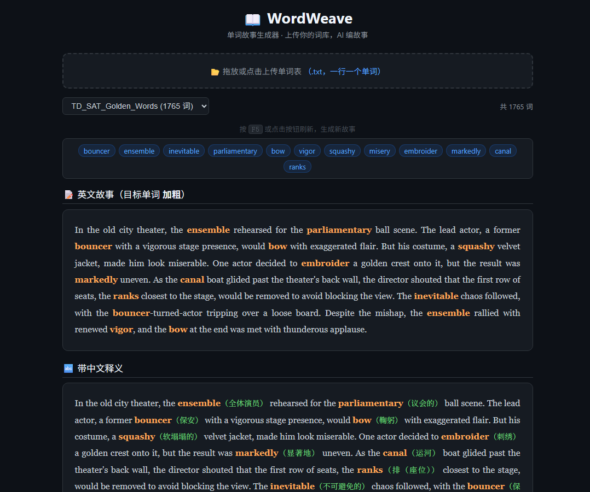

# WordWeave 📖✨

> **把枯燥的单词表，变成你追着读的英文故事。**



背单词最痛苦的是什么？

WordWeave 换个思路：**让 AI 用你要背的单词写故事。** 你上传一个单词表（一行一个），每次刷新页面，AI 就用随机抽取的单词现场编一篇全新的英文短篇——目标词高亮加粗，中文释义紧随其后。

你读的是故事，记的是单词。

---

## 🎯 解决什么问题

| 传统背单词 | WordWeave |
|---|---|
| 孤立记忆、脱离语境 | 单词嵌入自然故事，语境中习得 |
| 枯燥重复、容易放弃 | 每次刷新都是新故事，追着读 |
| 只背不用、很快遗忘 | 看到单词如何在句子里"活"起来 |
| 一本词书从头啃到尾 | 上传任意词库，SAT / 托福 / GRE / 四六级随便换 |

---

## ✨ 功能亮点

### 📂 上传任意词库
拖放一个 `.txt` 文件到页面（一行一个单词），自动入库。支持多个词库共存，下拉菜单随时切换。

```
apple
banana
cherry
...
```

### 🔀 多词库管理
- 上传 → 自动出现在下拉菜单
- 切换 → 换一套词，换一种故事风格  
- 删除 → 一键清理不需要的词库

### 📖 AI 即时编故事
每次按 `F5` 或点击 🔄 按钮，AI 随机抽取 12 个单词，现场创作一篇 150-300 词的英文小故事。

- 目标单词 **橙色加粗** → 一眼看到
- 下方同篇故事 → 每个单词后跟 **绿色中文释义**
- 故事连贯自然，不是生硬造句

### 🌙 深色主题 UI
暗色背景 + 高对比度文字，适合长时间阅读学习。圆角卡片、蓝/橙/绿配色，视觉层次清晰。

### 🐍 零依赖
纯 Python 标准库（`http.server` + `urllib`），不装任何第三方包就能跑。

---

## 🚀 快速开始

```bash
# 1. 克隆仓库
git clone https://github.com/tntsg1/WordWeave.git
cd WordWeave

# 2. 配置 API Key
cp .env.example .env
# 编辑 .env，填入你的 DeepSeek 或 OpenAI key

# 3. 启动
python story_server.py

# 4. 浏览器打开
# http://localhost:8888
```

Windows 用户直接双击 `启动单词故事.bat`。

默认自带 **TD SAT 黄金单词 5.0（1765 词）**，开箱即用。

---

## 🎨 效果预览

### 英文故事（目标词加粗）

> In the small, **unpretentious** town of Oakwood, Lily discovered a dusty **compendium** in her grandmother's attic. The book was **ornate**, with gold leaf and intricate carvings, but its contents were **scant**—only a few pages of odd symbols and a single word: **stardust**...

### 带中文释义

> In the small, **unpretentious**（朴实无华的） town of Oakwood, Lily discovered a dusty **compendium**（概要） in her grandmother's attic. The book was **ornate**（华丽的）, with gold leaf and intricate carvings, but its contents were **scant**（不足的）...

---

## 🛠 技术栈

| 层 | 技术 |
|---|---|
| 后端 | Python 3 标准库 (`http.server`) |
| AI | DeepSeek / OpenAI 兼容 API |
| 前端 | 原生 HTML/CSS/JS，零框架 |
| 存储 | 本地文件系统 (`wordlists/` 目录) |

---

## ⚙️ 自定义

```bash
# 环境变量 / .env 配置
DEEPSEEK_API_KEY=sk-xxx    # API Key（DeepSeek 或 OpenAI）
API_BASE=https://api.deepseek.com/v1   # API 地址
STORY_MODEL=deepseek-chat   # 模型名
```

`.env` 已被 `.gitignore` 排除，不会泄露到仓库。

---

## 📄 许可

MIT License — 自由使用、修改、分发。
